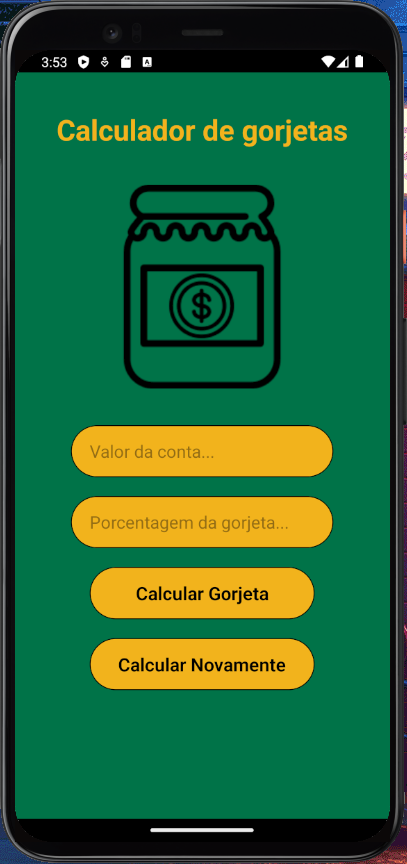
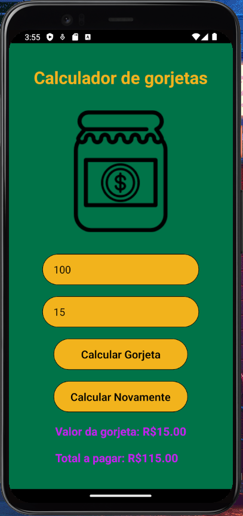

## Calculador de gorjeta (Tip calulator)
* Com este aplicativo é possível calcular o valor de gorjetas. Basta inserir o valor total da conta e depois inserir o percentual da gorjeta desejada. A gorjeta é calculada sobre o valor total da conta.
* With this application you can calculate the amount of tips. Simply enter the total bill amount and then enter the desired tip percentage. The tip is calculated on the total amount of the bill.

    
    

## Download⬇️
* <a href="src/ReadmeSrc/calc_gorjeta_demo.mp4">Download do vídeo de demonstração do app</a>
* <a href="src/ReadmeSrc/calc_gorjeta_demo.mp4">Download a demo video of the app here</a>

## Tecnologias (Technologies)💻
* React Native (Expo-cli)

## Contato (Contact me)🔗
* Email: gabriel.avilaa27@gmail.com
* LinkedIn: https://www.linkedin.com/in/gabriel-avila-10a077218/
